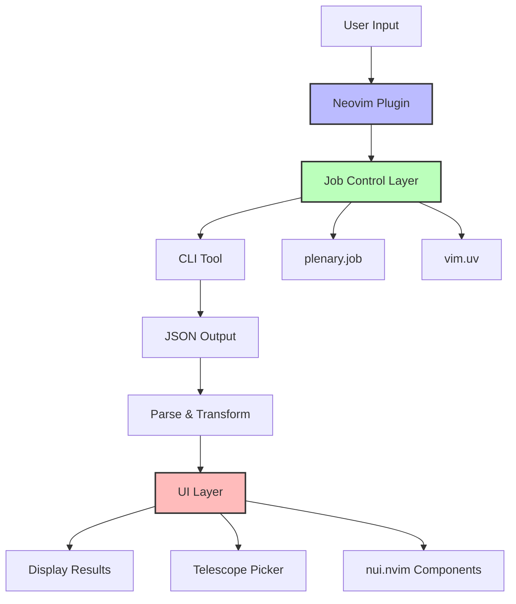
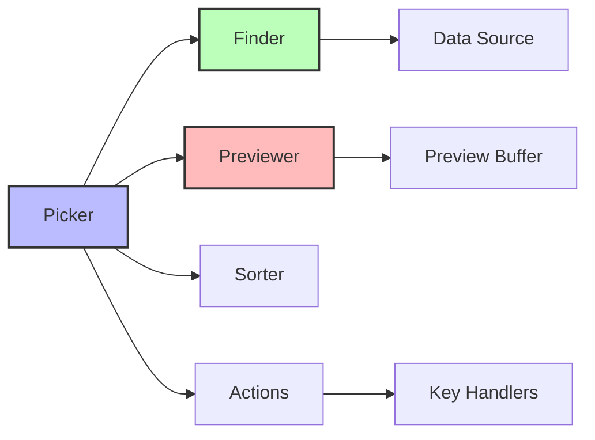
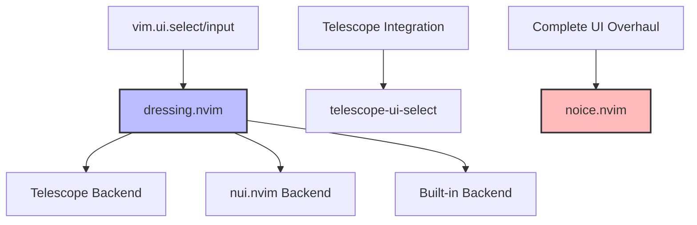

A comprehensive guide to building Neovim plugins that wrap command-line tools with rich UIs.

## Table of Contents

1. [Architecture Overview](#architecture-overview)
2. [Job Control & Async Execution](#job-control--async-execution)
3. [UI Libraries](#ui-libraries)
4. [Recommended Patterns](#recommended-patterns)
5. [Testing & Development](#testing--development)
6. [Tool Selection Guide](#tool-selection-guide)

---

## Architecture Overview



### Component Layers

1. **Job Control**: Execute CLI tools asynchronously
2. **Data Processing**: Parse and transform CLI output
3. **UI Layer**: Present data interactively
4. **User Actions**: Handle selections and commands

---

## Job Control & Async Execution

### plenary.nvim (Recommended)

The de facto standard for async job control in Neovim plugins.

#### Basic Usage

```lua
local Job = require('plenary.job')

-- Synchronous execution
local result = Job:new({
  command = 'git',
  args = {'status', '--porcelain'},
  cwd = '/path/to/repo',
}):sync()

-- Asynchronous execution with callbacks
Job:new({
  command = 'npm',
  args = {'install'},
  on_stdout = function(err, data)
    print('Output:', data)
  end,
  on_stderr = function(err, data)
    print('Error:', data)
  end,
  on_exit = function(job, return_val)
    print('Exit code:', return_val)
    print('Results:', table.concat(job:result(), '\n'))
  end,
}):start()
```

#### Job Chaining

```lua
Job:new({ command = 'git', args = {'fetch'} })
  :and_then_on_success(function()
    return Job:new({ command = 'git', args = {'rebase'} })
  end)
  :and_then_on_failure(function()
    vim.notify('Fetch failed', vim.log.levels.ERROR)
  end)
  :start()
```

#### Key Methods

| Method             | Description            | Use Case                |
| ------------------ | ---------------------- | ----------------------- |
| `:sync()`          | Block until completion | Simple data fetching    |
| `:start()`         | Run asynchronously     | Background operations   |
| `:wait()`          | Block on async job     | Sequential operations   |
| `:result()`        | Get stdout lines       | Retrieve command output |
| `:stderr_result()` | Get stderr lines       | Error handling          |

#### Configuration Options

```lua
{
  command = 'string',        -- Required: executable name
  args = {'table'},          -- Command arguments
  cwd = '/path',             -- Working directory
  env = {KEY='value'},       -- Environment variables
  on_start = function() end, -- Callback when job starts
  on_stdout = function(err, data) end,
  on_stderr = function(err, data) end,
  on_exit = function(job, code) end,
}
```

### vim.uv (Native API)

Lower-level libUV bindings for complex scenarios.

```lua
-- Process spawning
local handle, pid = vim.uv.spawn('ls', {
  args = {'-la'},
  stdio = {stdin, stdout, stderr}
}, function(code, signal)
  print('Exit code:', code)
end)

-- Timer example
local timer = vim.uv.new_timer()
timer:start(1000, 750, vim.schedule_wrap(function()
  -- Must wrap API calls in vim.schedule_wrap()
  vim.notify('Timer fired')
end))

-- Remember to close handles
timer:stop()
timer:close()
```

#### When to Use vim.uv

- Complex event loops
- Network operations (TCP/UDP)
- File system monitoring
- Fine-grained process control
- Custom streaming parsers

---

## UI Libraries

### Telescope.nvim

Perfect for browsable lists with fuzzy search and preview.



#### Complete Example

````lua
local pickers = require('telescope.pickers')
local finders = require('telescope.finders')
local previewers = require('telescope.previewers')
local actions = require('telescope.actions')
local action_state = require('telescope.actions.state')
local conf = require('telescope.config').values

local function show_docker_containers(opts)
  opts = opts or {}

  pickers.new(opts, {
    prompt_title = 'Docker Containers',

    -- Data source
    finder = finders.new_dynamic({
      fn = function()
        local job = require('plenary.job'):new({
          command = 'docker',
          args = {'ps', '--format', '{{json .}}'},
        }):sync()

        local containers = {}
        for _, line in ipairs(job) do
          table.insert(containers, vim.json.decode(line))
        end
        return containers
      end,

      entry_maker = function(container)
        return {
          value = container,
          display = string.format('%s - %s',
            container.Names, container.Status),
          ordinal = container.Names .. ' ' .. container.Image,
        }
      end,
    }),

    -- Sorting
    sorter = conf.generic_sorter(opts),

    -- Preview pane
    previewer = previewers.new_buffer_previewer({
      title = 'Container Details',
      define_preview = function(self, entry)
        local lines = vim.tbl_flatten({
          '# ' .. entry.value.Names,
          '',
          'Image: ' .. entry.value.Image,
          'Status: ' .. entry.value.Status,
          'Ports: ' .. entry.value.Ports,
          '',
          '```lua',
          vim.split(vim.inspect(entry.value), '\n'),
          '```',
        })

        vim.api.nvim_buf_set_lines(
          self.state.bufnr, 0, -1, false, lines
        )

        -- Syntax highlighting
        require('telescope.previewers.utils')
          .highlighter(self.state.bufnr, 'markdown')
      end,
    }),

    -- Key mappings
    attach_mappings = function(prompt_bufnr)
      actions.select_default:replace(function()
        local selection = action_state.get_selected_entry()
        actions.close(prompt_bufnr)

        -- Execute action with selected container
        vim.fn.system('docker exec -it ' .. selection.value.ID .. ' bash')
      end)

      return true
    end,
  }):find()
end
````

#### Finder Types

```lua
-- Static list
finders.new_table({
  results = {'item1', 'item2', 'item3'},
  entry_maker = function(item) ... end,
})

-- Dynamic (recalculates on refresh)
finders.new_dynamic({
  fn = function() return get_items() end,
  entry_maker = function(item) ... end,
})

-- Async job
finders.new_job({
  command = 'rg',
  args = {'pattern', '--json'},
  entry_maker = function(line) ... end,
})
```

### nui.nvim

For custom UIs beyond Telescope's scope.

#### Popup Component

```lua
local Popup = require('nui.popup')

local popup = Popup({
  enter = true,
  focusable = true,
  border = {
    style = 'rounded',
    text = {
      top = ' My Popup ',
      top_align = 'center',
    },
  },
  position = '50%',
  size = {
    width = '80%',
    height = '60%',
  },
})

popup:mount()

-- Set content
vim.api.nvim_buf_set_lines(popup.bufnr, 0, -1, false, {
  'Line 1',
  'Line 2',
  'Line 3',
})

-- Keymaps
popup:map('n', 'q', function()
  popup:unmount()
end)
```

#### Input Component

```lua
local Input = require('nui.input')

local input = Input({
  position = '50%',
  size = {
    width = 40,
    height = 1,
  },
  border = {
    style = 'single',
    text = {
      top = ' Enter Name ',
      top_align = 'center',
    },
  },
}, {
  prompt = '> ',
  default_value = 'default',
  on_submit = function(value)
    print('Submitted:', value)
  end,
  on_close = function()
    print('Input closed')
  end,
})

input:mount()
```

#### Menu Component

```lua
local Menu = require('nui.menu')

local menu = Menu({
  position = '50%',
  size = {
    width = 40,
    height = 10,
  },
  border = {
    style = 'single',
    text = {
      top = ' Select Option ',
      top_align = 'center',
    },
  },
}, {
  lines = {
    Menu.item('Option 1'),
    Menu.item('Option 2'),
    Menu.separator('---'),
    Menu.item('Option 3'),
  },
  max_width = 40,
  keymap = {
    focus_next = { 'j', '<Down>', '<Tab>' },
    focus_prev = { 'k', '<Up>', '<S-Tab>' },
    close = { '<Esc>', '<C-c>' },
    submit = { '<CR>', '<Space>' },
  },
  on_submit = function(item)
    print('Selected:', item.text)
  end,
})

menu:mount()
```

#### Layout Component

```lua
local Layout = require('nui.layout')
local Popup = require('nui.popup')

local popup1 = Popup({ border = 'single' })
local popup2 = Popup({ border = 'double' })
local popup3 = Popup({ border = 'rounded' })

local layout = Layout(
  {
    position = '50%',
    size = {
      width = 80,
      height = 40,
    },
  },
  Layout.Box({
    Layout.Box(popup1, { size = '40%' }),
    Layout.Box({
      Layout.Box(popup2, { size = '50%' }),
      Layout.Box(popup3, { size = '50%' }),
    }, { dir = 'col', size = '60%' }),
  }, { dir = 'row' })
)

layout:mount()
```

### Complementary UI Plugins



#### dressing.nvim

Improves `vim.ui.select` and `vim.ui.input` automatically:

```lua
require('dressing').setup({
  input = {
    enabled = true,
    default_prompt = '> ',
    prefer_width = 40,
    backend = { 'telescope', 'nui', 'builtin' },
  },
  select = {
    enabled = true,
    backend = { 'telescope', 'nui', 'builtin' },
    telescope = require('telescope.themes').get_cursor(),
  },
})

-- Now all plugins using vim.ui get nice UIs
vim.ui.select({'option1', 'option2'}, {
  prompt = 'Choose:',
}, function(choice)
  print('Selected:', choice)
end)
```

---

## Recommended Patterns

### Pattern 1: Simple CLI Wrapper

```lua
local M = {}

-- Configuration
M.config = {
  cli_path = 'kubectl',
  default_namespace = 'default',
}

-- CLI wrapper with JSON parsing
M.run_command = function(args)
  local Job = require('plenary.job')

  local full_args = vim.tbl_flatten({
    args,
    '--output', 'json',
    '--namespace', M.config.default_namespace,
  })

  local job = Job:new({
    command = M.config.cli_path,
    args = full_args,
  }):sync()

  local output = table.concat(job, '\n')
  if output == '' then
    return {}
  end

  local ok, result = pcall(vim.json.decode, output)
  if not ok then
    vim.notify('Failed to parse JSON: ' .. result, vim.log.levels.ERROR)
    return {}
  end

  return result
end

-- Telescope picker
M.show_pods = function(opts)
  opts = opts or {}
  local pickers = require('telescope.pickers')
  local finders = require('telescope.finders')
  local conf = require('telescope.config').values

  pickers.new(opts, {
    prompt_title = 'Kubernetes Pods',
    finder = finders.new_dynamic({
      fn = function()
        return M.run_command({'get', 'pods'})
      end,
      entry_maker = function(pod)
        return {
          value = pod,
          display = pod.metadata.name,
          ordinal = pod.metadata.name,
        }
      end,
    }),
    sorter = conf.generic_sorter(opts),
  }):find()
end

-- Setup function
M.setup = function(config)
  M.config = vim.tbl_extend('force', M.config, config or {})
end

return M
```

### Pattern 2: Async Data Loading

```lua
local M = {}

-- Async data fetcher
M.fetch_data_async = function(callback)
  local Job = require('plenary.job')

  Job:new({
    command = 'curl',
    args = {'-s', 'https://api.example.com/data'},
    on_exit = function(job, return_val)
      if return_val == 0 then
        local data = vim.json.decode(table.concat(job:result(), '\n'))
        callback(data)
      else
        vim.notify('Failed to fetch data', vim.log.levels.ERROR)
        callback(nil)
      end
    end,
  }):start()
end

-- Use with Telescope
M.show_async_data = function(opts)
  local pickers = require('telescope.pickers')
  local finders = require('telescope.finders')
  local conf = require('telescope.config').values

  pickers.new(opts, {
    prompt_title = 'Async Data',
    finder = finders.new_dynamic({
      fn = function(prompt)
        -- Return empty initially, update async
        vim.schedule(function()
          M.fetch_data_async(function(data)
            if data then
              -- Update picker with results
              -- This requires more advanced Telescope usage
            end
          end)
        end)
        return {}
      end,
    }),
    sorter = conf.generic_sorter(opts),
  }):find()
end

return M
```

### Pattern 3: Error Handling

```lua
local M = {}

-- Robust CLI execution with error handling
M.execute_safely = function(args, opts)
  opts = opts or {}
  local Job = require('plenary.job')
  local log = require('plenary.log').new({ plugin = 'my_plugin' })

  local stderr_output = {}

  local job = Job:new({
    command = opts.command or 'my-cli',
    args = args,
    cwd = opts.cwd,
    on_stderr = function(_, data)
      table.insert(stderr_output, data)
    end,
  })

  local ok, result = pcall(function()
    return job:sync(opts.timeout or 5000)
  end)

  if not ok then
    log.error('Job failed:', result)
    vim.notify(
      string.format('Command failed: %s', result),
      vim.log.levels.ERROR
    )
    return nil
  end

  local exit_code = job.code
  if exit_code ~= 0 then
    log.error('Non-zero exit:', exit_code, stderr_output)
    vim.notify(
      string.format('Command exited with code %d', exit_code),
      vim.log.levels.WARN
    )
    return nil
  end

  local output = table.concat(result, '\n')
  local data, err = vim.json.decode(output)
  if err then
    log.error('JSON parse error:', err)
    vim.notify('Invalid JSON response', vim.log.levels.ERROR)
    return nil
  end

  return data
end

return M
```

### Pattern 4: Interactive Actions

```lua
local M = {}

M.container_picker = function(opts)
  local pickers = require('telescope.pickers')
  local finders = require('telescope.finders')
  local actions = require('telescope.actions')
  local action_state = require('telescope.actions.state')

  pickers.new(opts, {
    prompt_title = 'Docker Containers',
    finder = finders.new_dynamic({
      fn = function()
        return M.get_containers()
      end,
    }),
    attach_mappings = function(prompt_bufnr, map)
      -- Default action: exec into container
      actions.select_default:replace(function()
        local selection = action_state.get_selected_entry()
        actions.close(prompt_bufnr)
        M.exec_container(selection.value.id)
      end)

      -- Custom action: stop container
      map('n', '<C-s>', function()
        local selection = action_state.get_selected_entry()
        M.stop_container(selection.value.id)
        -- Refresh picker
        action_state.get_current_picker(prompt_bufnr):refresh(
          finders.new_dynamic({ fn = function() return M.get_containers() end })
        )
      end)

      -- Custom action: view logs
      map('n', '<C-l>', function()
        local selection = action_state.get_selected_entry()
        M.show_logs(selection.value.id)
      end)

      return true
    end,
  }):find()
end

M.exec_container = function(container_id)
  vim.cmd('terminal docker exec -it ' .. container_id .. ' bash')
end

M.stop_container = function(container_id)
  vim.fn.system('docker stop ' .. container_id)
  vim.notify('Container stopped', vim.log.levels.INFO)
end

M.show_logs = function(container_id)
  local Job = require('plenary.job')
  local Popup = require('nui.popup')

  local popup = Popup({
    enter = true,
    border = { style = 'rounded', text = { top = ' Logs ' } },
    position = '50%',
    size = { width = '90%', height = '90%' },
  })

  popup:mount()

  Job:new({
    command = 'docker',
    args = {'logs', '--tail', '100', container_id},
    on_stdout = function(_, data)
      vim.schedule(function()
        vim.api.nvim_buf_set_lines(popup.bufnr, -1, -1, false, {data})
      end)
    end,
  }):start()

  popup:map('n', 'q', function() popup:unmount() end)
end

return M
```

---

## Testing & Development

### mini.test (Recommended)

```lua
-- tests/test_plugin.lua
local MiniTest = require('mini.test')
local expect = MiniTest.expect

local T = MiniTest.new_set()

T['run_command'] = MiniTest.new_set()

T['run_command']['returns parsed JSON'] = function()
  local plugin = require('my_plugin')
  local result = plugin.run_command({'get', 'pods'})

  expect.truthy(result)
  expect.array(result)
end

T['run_command']['handles errors'] = function()
  local plugin = require('my_plugin')
  plugin.config.cli_path = 'nonexistent-command'

  local result = plugin.run_command({'get', 'pods'})
  expect.no_error(function() return result end)
end

return T
```

### plenary.nvim Test Framework

```lua
-- tests/plugin_spec.lua
local plugin = require('my_plugin')

describe('my_plugin', function()
  it('should parse JSON output', function()
    local result = plugin.run_command({'get', 'pods'})
    assert.truthy(result)
    assert.is_table(result)
  end)

  it('should handle missing CLI', function()
    plugin.config.cli_path = 'missing'
    local result = plugin.run_command({'get', 'pods'})
    assert.is_nil(result)
  end)
end)
```

### Makefile for Testing

```makefile
.PHONY: test format lint

NVIM = nvim

test:
	$(NVIM) --headless -u tests/minimal_init.lua \
		-c "lua require('mini.test').run()" \
		-c "qa!"

format:
	stylua lua/ tests/

lint:
	luacheck lua/ tests/
```

### Minimal Init for Tests

```lua
-- tests/minimal_init.lua
local tempdir = vim.fn.tempname()
vim.fn.mkdir(tempdir, 'p')

local package_root = tempdir .. '/site/pack'
local install_path = package_root .. '/deps/start/plenary.nvim'

if vim.fn.isdirectory(install_path) == 0 then
  vim.fn.system({
    'git', 'clone',
    'https://github.com/nvim-lua/plenary.nvim',
    install_path,
  })
end

vim.opt.runtimepath:append(install_path)
vim.opt.runtimepath:append('.')

vim.cmd('runtime! plugin/**/*.lua')
```

---

## Tool Selection Guide

### Decision Tree

```flowchart
st=>start: Need to wrap CLI tool?
e=>end: Done

telescope=>condition: Need browsable list
with fuzzy search?

custom_ui=>condition: Need custom
form or dialog?

simple_list=>condition: Simple selection
from few items?

job_control=>operation: Use plenary.job
for CLI execution

use_telescope=>operation: Use Telescope.nvim
+ plenary.job

use_nui=>operation: Use nui.nvim
+ plenary.job

use_vimui=>operation: Use vim.ui.select
+ dressing.nvim

complex_async=>condition: Complex async
patterns needed?

use_vimuv=>operation: Use vim.uv
+ custom handling

st->job_control->telescope
telescope(yes)->use_telescope->e
telescope(no)->custom_ui
custom_ui(yes)->use_nui->e
custom_ui(no)->simple_list
simple_list(yes)->use_vimui->e
simple_list(no)->complex_async
complex_async(yes)->use_vimuv->e
complex_async(no)->use_telescope->e
```

### Capability Matrix

| Feature           | Telescope       | nui.nvim       | vim.ui + dressing | vim.uv |
| ----------------- | --------------- | -------------- | ----------------- | ------ |
| Fuzzy search      | ✅              | ❌             | ❌                | ❌     |
| Preview pane      | ✅              | ⚠️ Manual      | ❌                | ❌     |
| Custom forms      | ❌              | ✅             | ⚠️ Limited        | ❌     |
| Popups/dialogs    | ⚠️ Preview only | ✅             | ⚠️ Limited        | ❌     |
| Complex layouts   | ❌              | ✅             | ❌                | ❌     |
| Job control       | ⚠️ Via plenary  | ⚠️ Via plenary | ⚠️ Via plenary    | ✅     |
| Learning curve    | Medium          | Medium         | Low               | High   |
| Setup complexity  | Low             | Low            | Very Low          | High   |
| Community plugins | High            | Medium         | High              | Low    |

### Common Combinations

```chart
{
  "type": "bar",
  "data": {
    "labels": ["Telescope + plenary", "nui + plenary", "vim.ui + dressing", "vim.uv + custom", "Telescope + nui"],
    "datasets": [{
      "label": "Popularity Score",
      "data": [95, 60, 75, 25, 40],
      "backgroundColor": "rgba(54, 162, 235, 0.5)",
      "borderColor": "rgba(54, 162, 235, 1)",
      "borderWidth": 1
    }]
  },
  "options": {
    "scales": {
      "y": {
        "beginAtZero": true,
        "max": 100
      }
    }
  }
}
```

**Most Popular Combinations:**

1. **Telescope + plenary.job** (95%)
   - CLI wrappers with browsable lists
   - Your telescope-quix, telescope-kafka, telescope-docker plugins
   - Examples: telescope-github, telescope-docker.nvim

2. **vim.ui + dressing.nvim** (75%)
   - Simple selections and inputs
   - Minimal setup required
   - Works with existing plugins automatically

3. **nui.nvim + plenary.job** (60%)
   - Custom forms and complex dialogs
   - Non-list-based interfaces
   - Configuration wizards

4. **Telescope + nui.nvim** (40%)
   - Main UI in Telescope
   - Dialogs/forms for actions
   - Best of both worlds

5. **vim.uv + custom** (25%)
   - Specialized use cases
   - Real-time streaming data
   - Network operations

---

## Additional Resources

### Essential Plugins

- **plenary.nvim**: https://github.com/nvim-lua/plenary.nvim
- **telescope.nvim**: https://github.com/nvim-telescope/telescope.nvim
- **nui.nvim**: https://github.com/MunifTanjim/nui.nvim
- **dressing.nvim**: https://github.com/stevearc/dressing.nvim

### Documentation

- **Neovim Lua Guide**: https://neovim.io/doc/user/lua-guide.html
- **vim.uv (luv) API**: https://neovim.io/doc/user/lua.html
- **Telescope Developer Docs**: https://github.com/nvim-telescope/telescope.nvim/blob/master/developers.md
- **nui.nvim Tutorial**: https://muniftanjim.dev/blog/neovim-build-ui-using-nui-nvim/

### Example Plugins

From your config:

- `telescope-quix.nvim`: Quix platform integration
- `telescope-kafka.nvim`: Kafka topic browser
- `telescope-docker.nvim`: Docker management

Community examples:

- `telescope-github.nvim`: GitHub integration
- `telescope-docker.nvim`: Docker container management
- `telescope-frecency.nvim`: Frecency-based file picker

### Testing Tools

- **mini.test**: https://github.com/echasnovski/mini.test
- **plenary.test**: Built into plenary.nvim
- **busted**: https://github.com/Olivine-Labs/busted

### Development Tools

- **stylua**: Lua code formatter
- **luacheck**: Lua linter
- **lua-language-server**: LSP for Lua (lua_ls)

---

## Quick Start Template

```lua
-- lua/my_cli_wrapper.lua
local M = {}

M.config = {
  cli_path = 'my-cli',
}

M.run_cli = function(args)
  local Job = require('plenary.job')
  local job = Job:new({
    command = M.config.cli_path,
    args = vim.tbl_flatten({args, '--json'}),
  }):sync()
  return vim.json.decode(table.concat(job, '\n'))
end

M.show_items = function(opts)
  local pickers = require('telescope.pickers')
  local finders = require('telescope.finders')
  local conf = require('telescope.config').values

  pickers.new(opts or {}, {
    prompt_title = 'CLI Items',
    finder = finders.new_dynamic({
      fn = function() return M.run_cli({'list'}) end,
      entry_maker = function(item)
        return {
          value = item,
          display = item.name,
          ordinal = item.name,
        }
      end,
    }),
    sorter = conf.generic_sorter(opts),
  }):find()
end

M.setup = function(config)
  M.config = vim.tbl_extend('force', M.config, config or {})
end

return M
```

---

## Conclusion

The Neovim plugin ecosystem provides excellent tools for wrapping CLI applications:

1. **Start with Telescope + plenary.job** for most use cases
2. **Add nui.nvim** when you need custom forms or dialogs
3. **Use dressing.nvim** for quick wins with vim.ui
4. **Reserve vim.uv** for complex async scenarios

Your existing telescope-quix.nvim plugin demonstrates the recommended pattern perfectly. Build on that foundation for new CLI wrappers.
